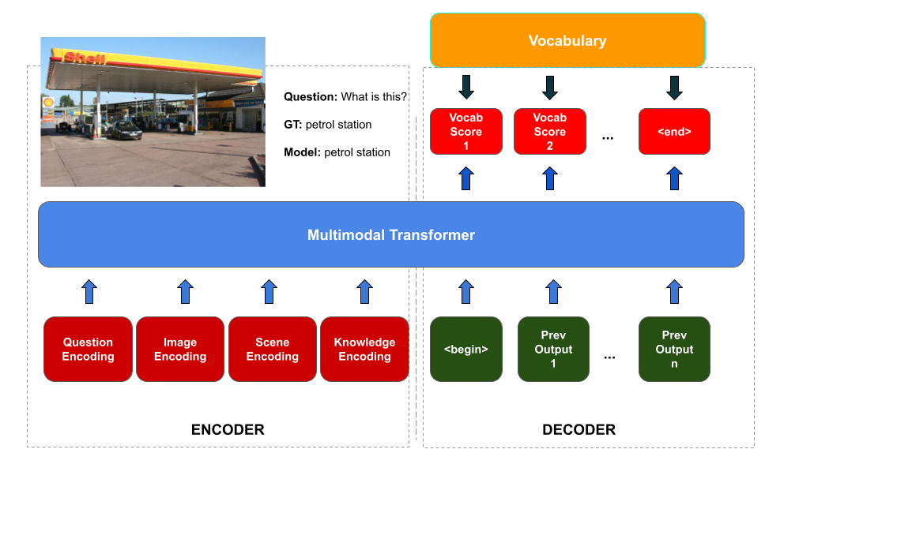

# TextKVQA

In this work, we are trying to solve the problem of visual question answering on the knowledge enabled TextKVQA dataset. Following is the model:



The packages are present in requirements.txt.
Following https://github.com/yashkant/sam-textvqa, install pytorch:
```bash
conda install pytorch torchvision cudatoolkit=10.0 -c pytorch
```
Look out for the cuda version that works on your system.
Also, install apex from: https://github.com/NVIDIA/apex.

Our model involves multiple modalities, and quite a large amount of preprocessing. Let us look at the preprocessing steps first.

## Text Detector and Extractor
Create a folder called detector. Inside detector, clone the following:
```bash
https://github.com/clovaai/CRAFT-pytorch
https://github.com/clovaai/deep-text-recognition-benchmark
```

Download the pretrained models from:
Detector : https://github.com/clovaai/CRAFT-pytorch \
Recognizer : https://github.com/clovaai/deep-text-recognition-benchmark

Put pretrained text-detector model at 'detector/pretrained-models/text_detection_pretrained_model/craft_mlt_25k.pth'
Put pretrained text-recognition model at 'detector/pretrained-models/text-recognition/TPS-ResNet-BiLSTM-Attn.pth'

In train.py, in the main function, make create_ocr_feats = True and all other flags = False, and run train.py

## Data
For the images, create a folder called data/images. Inside data/images, download the following images from http://dosa.cds.iisc.ac.in/kvqa/text-KVQA-scene.tar.gz
From the same link, download the questions. Put them in the data folder as well.

## FRCNN features
In train.py, in the main function, make create_obj_feats = True, all other flags = False, and run train.py.

## Scene labels
In train.py, in the main function, make recognize_scenes = True, all other flags = False, and run train.py.

## Knowledge Graph Pruning
First download the knowledge graph from https://drive.google.com/file/d/1uqjE2cd2vmRyFLJBQOQaLAQrheR0aMmw/view?usp=sharing. Put it in the main directory.
In train.py, in the main function, make find_string_ocr_simi = True, all other flags = False, and run train.py.

## Training
In train.py, in the main function, make train = True, all other flags = False, and run train.py. Number of epochs is set to 10. For the current split of the data, it is enough to reach saturation.

## Model
The model is written in mmt.py. The current model is the most successful model as mentioned in the report.
Note: Currently, the dataset is split randomly for each image question pair. All the results reported are based on this splitting. However in the paper https://openaccess.thecvf.com/content_ICCV_2019/papers/Singh_From_Strings_to_Things_Knowledge-Enabled_VQA_Model_That_Can_Read_ICCV_2019_paper.pdf, the data is split based on the entities present in the dataset in such a way that each entity in the training dataset is disjoint from the entities in the validation dataset and the test dataset. The authors have made sure that all entities are different in all three datasets, which has made their model more realistic and robust to unseen data. Our present work does not yet consider that, because of which the results from the paper are not mentioned in the end sem ppt or the report. Training the model based on this disjoing splitting is still in process and this readme file will be updated as and when the training happens successfully.

## Evaluation
To evaluate the model on test run evaluate.py. Inside evaluate.py, mention the name of the saved model that is to be evaluated. The current version of this code prints all the wrong answers predicted by the model and reports accuracy.
